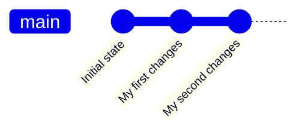
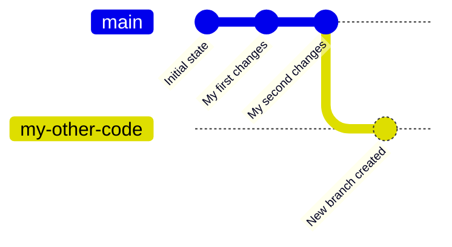
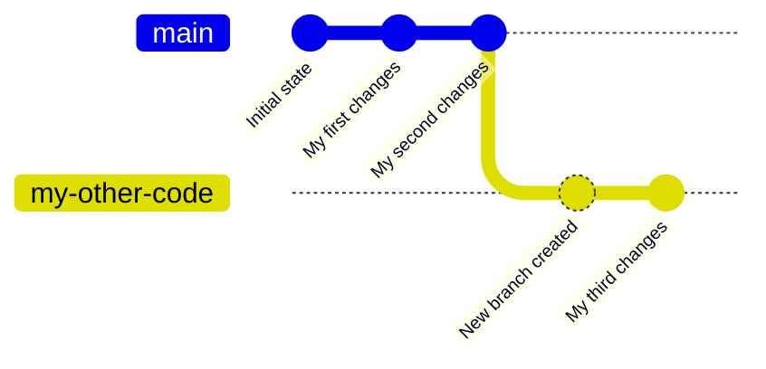

import { Video } from "@site/src/components/Video";

# Setup Your Environment
Before you can begin writing code, you need to set things up. You need to:
1. Make a GitHub account
2. Join our GitHub organization
3. Create a branch
4. Download an IDE
5. Clone your branch

Let's get started!

## Make a GitHub account
Go to GitHub's [sign-up](https://github.com/signup) page and enter your email, create a password, and create a username. Make sure to save these somewhere or remember them&mdash;you'll need to use this account frequently!

:::note
If you already have a GitHub account, you can use it. Just skip this step and login.
:::

## Join our GitHub organization
Once you've created and logged into your account, you need to ask a team mentor or coach to invite you to our GitHub organization. You'll receive this invite in your email. Open the email and follow the steps to join the organization.

You might also want to join our GitHub team as well. Ask a mentor or coach to invite you to that if you want. At the time of writing it isn't used for anything, but it may become important in the future.

## Create a branch
Once you're in our organization, you are granted the ability to write and change code. But first, you'll want to create your own space to write your own code. Also, you should probably get familiar with the basics of version control if you haven't already.

### How Version Control Works
We use a version-control-system (VCS) called Git to help facilitate collaboration and organization. Git provides us with a folder to store our code files in called a **repository**. When you change something inside this folder, you can **commit** it to Git. This will save a copy of the folder in its current state, meaning any files will be backed up exactly as they were when you committed.

Then, you can edit some files again, commit again, and now you have two back-ups: one with the first set of changes, and one with the next. Git lets you **checkout**, or switch between these versions, so you can revert any changes you've made if you made a mistake and keep track of what has changed over time. You can visualize it like this, which is called a commit graph:



:::tip
If it's not already obvious, commits on the left of the graph are older, and commits on the right of the graph are newer.
:::

If you wanted to, you could roll the repository back to the "My first changes" commit or even the "Initial state" commit by **checking out** the corresponding commit.

Git also allows you to create **branches**. These are different lines of backups that branch off from the main line of backups, also called the `main` or `master` branch, letting you have multiple different versions of a repository side-by-side. Let's say you made a branch called `my-other-code`:



If you checked out the original line of commits (the `master` branch), made some changes, and committed again, it would add a commit to the `master` branch like this:

```mermaid
gitGraph
commit id: "Initial state"
commit id: "My first changes"
commit id: "My second changes"
branch "my-other-code"
checkout "my-other-code"
commit id: "New branch created"
checkout "master"
commit id: "My third changes"
```

But, if you checked out the `my-other-code` branch, made some changes, and committed again, it would add a commit to the `my-other-code` branch like this:



Using branches, you can split up your commits into multiple lines of commits, so you can make and backup changes independent of eachother. Let's make a few more commits to visualize this:

```mermaid
gitGraph
commit id: "Initial state"
commit id: "My first changes"
commit id: "My second changes"
branch "my-other-code"
checkout "my-other-code"
commit id: "New branch created"
checkout "master"
commit id: "Some changes"
checkout "my-other-code"
commit id: "A bunch of changes"
checkout "master"
commit id: "Some more changes"
checkout "my-other-code"
commit id: "Even more changes"
commit id: "Last change on this branch"
```

You can also merge branches back into eachother. When you merge branches, the changes from one branch are combined with the changes from another branch. If any changes conflict with eachother, Git prompts you to choose which change you want to keep. You can visualize it like this:

```mermaid
gitGraph
commit id: "Initial state"
commit id: "My first changes"
commit id: "My second changes"
branch "my-other-code"
checkout "my-other-code"
commit id: "New branch created"
checkout "master"
commit id: "Some changes"
checkout "my-other-code"
commit id: "A bunch of changes"
checkout "master"
commit id: "Some more changes"
checkout "my-other-code"
commit id: "Even more changes"
commit id: "Last change on this branch"
checkout "master"
merge "my-other-code" id: "Merged the changes!"
commit id: "More changes"
```

Using commits, branches, and merges, we can manage our codebase quite efficently. We have one Git repository that we share between everyone. We store it on GitHub which is a cloud service that's designed to store Git repositories. Think of GitHub as if it was Google Drive but for coding.

Our repository has a bunch of branches. The `master` branch is the main bug-free and stable robot code that we use for competitions. Each team member (who wants to write code) branches off of the `master` branch onto their own branches. When they're ready, they merge the changes they made on their branch into the `master` branch. They can then delete their branch, continue coding on their branch, or even merge the `master` branch into their branch so their branch can stay up-to-date with the latest code from other team members.

### Creating your branch
Now that you understand how branches work, you can create your own. First of all, head over to our [repository](https://github.com/XaverianTeamRobotics/FtcRobotController). Click on the branch button, type in `dev/<your-first-name>`, and click Create Branch. For example, if your name was Lasagna Man:

<Video src="/assets/create-branch.mp4" height={"400px"} width={"400px"} loop/>

## Download an IDE
The next step of this process is downloading a code editor, or IDE. You have two options:
1. IntelliJ IDEA Ultimate
2. Android Studio

This guide will assume you picked **IntelliJ IDEA Ultimate**. We recommend choosing IntelliJ over Android Studio as it's much more powerful, albeit you may want to choose Android Studio if you need support for the bleeding-edge of Android development (IntelliJ usually releases support for new Android features a few months after Android Studio supports them).

:::note
Unlike this guide, the spring programming course begins with Android Studio before moving on to IntelliJ IDEA Ultimate because it's easier for beginners to learn.
:::

### Getting a License

Before you download IntelliJ, you'll need to get a JetBrains license (we're using the paid version). The good thing is that it's completely free for Xaverian students! You'll first need to [create a JetBrains account](https://account.jetbrains.com/login). After creating an account, head over to the [student license application](https://www.jetbrains.com/shop/eform/students). Make sure to enter your Xaverian email!

<p>
  
</p>

After you finish the process, you should see your license on your [account page](https://account.jetbrains.com/licenses):

<p>
  
</p>

:::caution
Your license needs to be renewed yearly. You can do this by clicking "Buy new license" and selecting to renew your student license at the bottom of the pop-up.
:::

### Downloading IntelliJ IDEA Ultimate

